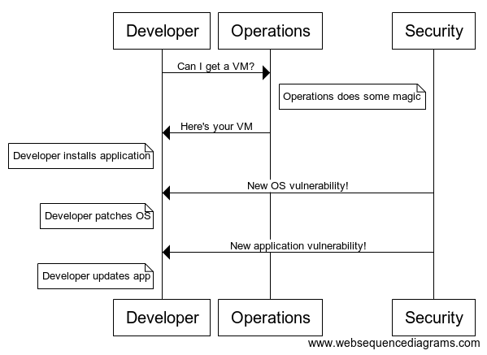
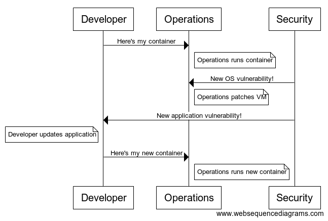

export { default as theme } from './theme.js';
import { Notes } from 'mdx-deck';

# Intro To 


<Notes>
Developers? Admins? Heard of Docker? Use Docker?
</Notes>

---

# Bradford Roarr
## Software Developer for CIS

---

# Docker

* distributes _containers_
* runs _containers_
* builds _containers_
* networks _containers_

---

# Containers
## Lightweight Virtual Machines

---


---

# Containers

* Shares kernel with the host
* `namespaces(7)` to isolate processes/user/net/etc. 
* `cgroups(7)` to monitor/restrict access to resources
* Union filesystems to build up images

---

## Pre-Container Workflow



<Notes>
Pre docker world ops hands devs virtual machines to install applications
and manage software.
</Notes>

---

## Post-Container Workflow



<Notes>
Post docker world devs are only responsible for their applications.
</Notes>

---


---

## Running Containers

```
docker pull
docker image list
docker image rm
docker run
docker exec
```

---

### `docker pull mariadb:10`

```
10: Pulling from library/mariadb
6abc03819f3e: Pull complete
05731e63f211: Pull complete
0bd67c50d6be: Pull complete
.
.
.
e24ad9b92026: Pull complete
6f63a97f6b5c: Pull complete
0a5b8607a3ac: Pull complete
Digest: sha256:48f2bbe16e546469b92d2f9c70c684b5...
Status: Downloaded newer image for mariadb:10
```

<Notes>
Each pull complete line is a sliver of the filesystem, the final mariadb image
needs all of the slivers.
</Notes>

---

### `docker image ls`

```
REPOSITORY  TAG  IMAGE ID      CREATED     SIZE
mariadb     10   56089178535f  5 days ago  349MB
```

<Notes>
Shows all the docker images we've downloaded so far.
</Notes>

---

### `docker pull python:3.7`

```
3.7: Pulling from library/python
Digest: sha256:bc0a967762b9561b27230cf04cd927a9...
Status: Image is up to date for python:3.7
```

### `docker image ls`

```
REPOSITORY  TAG  IMAGE ID      CREATED      SIZE
mariadb     10   56089178535f  5 days ago   349MB
python      3.7  a4cc999cf2aa  4 weeks ago  929MB
```

<Notes>
Lets pull a second image and make sure it downloaded correctly.
</Notes>

---

### `docker image rm mariadb:10`

```
Untagged: mariadb:10
Untagged: mariadb@sha256:48f2bbe16e546469b92d2f...
Deleted: sha256:56089178535fa9944adf2b14559c48d...
.
.
.
Deleted: sha256:02571d034293cb241c078d7ecbf7a84...
```

### `docker image ls`

```
REPOSITORY  TAG  IMAGE ID      CREATED      SIZE
python      3.7  a4cc999cf2aa  4 weeks ago  929MB
```

<Notes>
Shortcut is docker rmi mariadb:10
</Notes>

---

### `docker run python:3.7`

<Notes>
Nothing happens! Default runs a process in non-interactive mode.
</Notes>

---

### `docker run -it python:3.7`

```
Python 3.7.3 (default, May  8 2019, 05:28:42)
[GCC 6.3.0 20170516] on linux
Type "help", "copyright", "credits" or "license"
  for more information.
>>> print('hello world!')
hello world!
>>>
```

<Notes>
Use run -it to start a docker container in interactive mode.
</Notes>

---

### `docker run mariadb:10`

```
Unable to find image 'mariadb:10' locally
10: Pulling from library/mariadb
6abc03819f3e: Pull complete
05731e63f211: Pull complete
.
.
.
6f63a97f6b5c: Pull complete
0a5b8607a3ac: Pull complete
Digest: sha256:48f2bbe16e546469b92d2f9c70c684b5...
Status: Downloaded newer image for mariadb:10
error: database is uninitialized and password
  option is not specified You need to specify one
  of MYSQL_ROOT_PASSWORD, MYSQL_ALLOW_EMPTY_PASSWORD
  and MYSQL_RANDOM_ROOT_PASSWORD
```

<Notes>
If the image is not found locally, docker will automatically download the image
Some images require additional parameters to run, most varialbes are provided
via the environment.
</Notes>

---

#### `docker run -d -e MYSQL_ROOT_PASSWORD=root mariadb:10`

```
39a65fc0458c3fbfa8e2cca231b600e54e2c2ac1fb58031...
```

#### `docker ps`

```
CONTAINER ID  IMAGE      COMMAND       . PORTS    NAMES
39a65fc0458c  mariadb:10 "docker-e..." . 3306/tcp bohr
```

<Notes>
Providing the arguments started the database container, -d starts in background.
The container id is provided. GOTCHA: You can't exit this container if start it
in the foreground, you'll need to kill the container.
</Notes>

---

### `docker exec -it 39a65fc0458c mysql -p`

```
Enter password:
Welcome to the MariaDB monitor.
Commands end with ; or \g.
Your MariaDB connection id is 16
Server version: 10.3.15-MariaDB-1:10.3.15+maria...
  mariadb.org binary distribution

Copyright (c) 2000, 2018, Oracle, MariaDB
  Corporation Ab and others.

Type 'help;' or '\h' for help. Type '\c' to clear
  the current input statement.

MariaDB [(none)]>
```

<Notes>
To connect to the running container, use the container id and
the exec command
</Notes>

---

### `docker logs 39a65fc0458c`

```
...
2019-06-11 14:17:11 0 [Note] mysqld: ready for connections.
Version: '10.3.15-MariaDB-1:10.3.15+maria~bionic'
socket: '/var/run/mysqld/mysqld.sock'
port: 3306  mariadb.org binary distribution
```

### `docker kill 39a65fc0458c`

```
39a65fc0458c
```

<Notes>
docker logs gets the logs for that container from stdout and
stderror. Everything else is invisible to you.
</Notes>

---

## Building Containers

```
Dockerfile
docker build
```

---

### Application Layout

```
.
├── Dockerfile
├── hello-world.py
└── requirements.txt
```

---

### `Dockerfile`

```
FROM python:3.7

COPY requirements.txt
RUN pip install -r requirements.txt

COPY hello-world.py
CMD ["python", "hello-world.py"]
```

<Notes>
Commands are in all caps. This is just a small subset.
ENTRYPOINT, USER, WORKDIR, ADD, LABEL
</Notes>

---

### `hello-world.py`

```
#!/usr/bin/env python3

import requests

payload = {'text': 'Hello World!'}

r = requests.get(
  'https://artii.herokuapp.com/make',
  params=payload)

print(r.text)
```

---

### `docker build .`

```
Sending build context to Docker daemon  4.096kB
Step 1/5 : FROM python:3.7
 ---> a4cc999cf2aa
 ...
 ...
 ...
Step 5/5 : CMD ["python", "./hello-world.py"]
 ---> Running in 8bd0a92beed7
Removing intermediate container 8bd0a92beed7
 ---> c746e9707d32
Successfully built c746e9707d32
```

<Notes>
The second param to build is the context, a directory containing
your resources.
</Notes>

---

### `docker build .`

```
Sending build context to Docker daemon  4.096kB
Step 1/5 : FROM python:3.7
 ---> a4cc999cf2aa
Step 2/5 : COPY requirements.txt ./
 ---> Using cache
 ---> 3d3220b79e9c
Step 3/5 : RUN pip install -r requirements.txt
 ---> Using cache
 ---> 0bfd4dc8d3f6
Step 4/5 : COPY hello-world.py ./
 ---> Using cache
 ---> b2f89e8b413e
Step 5/5 : CMD ["python", "./hello-world.py"]
 ---> Using cache
 ---> c746e9707d32
Successfully built c746e9707d32
```

<Notes>
Second build uses the cache. To force rebuild use --no-cache
</Notes>

---

### `docker image ls`

```
docker image ls
REPOSITORY TAG    IMAGE ID     CREATED       SIZE
<none>     <none> c746e9707d32 5 minutes ago 937MB
```

<Notes>
By default images don't have names.
</Notes>

---

### `docker build -t hello-world:v0 .`

```
Sending build context to Docker daemon  4.096kB
Step 1/5 : FROM python:3.7
 ...
Step 5/5 : CMD ["python", "./hello-world.py"]
 ---> Using cache
 ---> c746e9707d32
Successfully built c746e9707d32
Successfully tagged hello-world:latest
```

### `docker image ls`

```
REPOSITORY  TAG IMAGE ID      CREATED        SIZE
hello-world v0  c746e9707d32  5 minutes ago  937MB
```

<Notes>
Tagging images allows you to refer to images by name
instead of image id.
</Notes>

---

### `docker run hello-world:v0`

```
  _    _      _ _        __          __        _     _ _
 | |  | |    | | |       \ \        / /       | |   | | |
 | |__| | ___| | | ___    \ \  /\  / /__  _ __| | __| | |
 |  __  |/ _ \ | |/ _ \    \ \/  \/ / _ \| '__| |/ _` | |
 | |  | |  __/ | | (_) |    \  /\  / (_) | |  | | (_| |_|
 |_|  |_|\___|_|_|\___/      \/  \/ \___/|_|  |_|\__,_(_)

```

<Notes>
Tagging containers make them much easier to run.
</Notes>

---

### `docker ps -a`

```
CONTAINER ID  IMAGE          COMMAND      STATUS
ce7870f9c546  hello-world:v0 "python ..." Exited (0)
```

### `docker rm ce7870f9c546`

```
ce7870f9c546
```

<Notes>
Docker keeps stopped containers around in case you want to restart them.
You'll want to periodically delete them. You can also run with --rm
</Notes>

---

## Networking Containers

```
docker network
```

---

### `docker network create my_network`

```
eb4fb9dabc36bbf133e467bf9f19e28c865a3181bdb298e...
```

### `docker network ls`

```
NETWORK ID       NAME          DRIVER        SCOPE
a300e3500a59     bridge        bridge        local
3a999f28974a     host          host          local
eb4fb9dabc36     my_network    bridge        local
da050356b455     none          null          local
```

---

##### `docker run -d --name=maria -e MYSQL_ROOT_PASSWORD=root mariadb:10`

```
847e670df0e789b2a728cbdfd1e641cac4e3e839f7643ca...
```

<Notes>
Naming a container allows you to easily refer to the running container.
</Notes>

---

### `docker network connect my_network maria`

```
$ echo $?
0
```

### `docker container inspect maria`

```
...
"my_network": {
    ...
    "NetworkID": "eb4fb9dabc36bbf133e467bf9fe...",
    "EndpointID": "2351dd4b378ee3d5fd3b08ae97...",
    "Gateway": "192.168.176.1",
    "IPAddress": "192.168.176.2",
    ...
}
...
```

<Notes>
Network connect has no output. Check status with $?. To verify
connect worked use inspect on your container
</Notes>

---

### `hello-world.py`

```
#!/usr/bin/env python3

import MySQLdb

db = MySQLdb.connect(
  host='maria',
  user='root',
  passwd='root')

print(db)
```

### `docker build -t hello-world:v0 .`

```
...
Successfully built f4f5c7570fbc
Successfully tagged hello-world:v0
```

<Notes>
New demo that uses a database. Remember to rebuild
</Notes>

---

### `docker run --network my_network hello-world:v0`

```
<_mysql.connection open to 'maria' at 0x56256d...>
```

<Notes>
Network can also be specified at runtime instead of after
the container is already running.
</Notes>

---

# Extra Slides

---

## Docker Compose

* Capture docker commands as code
* Simplify network commands
* Get started with orchestration

---

### `docker-compose.yml`

```
version: '3.1'
services:
  hello-world:
    build: .
  maria:
    image: 'mariadb:10'
    environment:
      - MYSQL_ROOT_PASSWORD=root
```

<Notes>
Each service is a docker container. Anything you typed at the
command line can be represented in a docker compose file.
</Notes>

---

### `docker-compose build`

```
maria uses an image, skipping
Building hello-world
Step 1/5 : FROM python:3.7
 ---> a4cc999cf2aa
 ...
 ...
 ...
Step 5/5 : CMD ["python", "./hello-world.py"]
 ---> Using cache
 ---> 7be2507a5395
Successfully built 7be2507a5395
Successfully tagged app_hello-world:latest
```

<Notes>
This command will build any services that have a
build parameter. Notice how it skips maria.
</Notes>

---

### `docker-compose up`

```
Recreating app_maria_1     ... done
Starting app_hello-world_1 ... done
Attaching to app_hello-world_1, app_maria_1
hello-world_1  |   _    _      _ _        __          __        _     _ _
hello-world_1  |  | |  | |    | | |       \ \        / /       | |   | | |
hello-world_1  |  | |__| | ___| | | ___    \ \  /\  / /__  _ __| | __| | |
hello-world_1  |  |  __  |/ _ \ | |/ _ \    \ \/  \/ / _ \| '__| |/ _` | |
hello-world_1  |  | |  | |  __/ | | (_) |    \  /\  / (_) | |  | | (_| |_|
hello-world_1  |  |_|  |_|\___|_|_|\___/      \/  \/ \___/|_|  |_|\__,_(_)
hello-world_1  |
hello-world_1  |
maria_1        | Initializing database
```

<Notes>
This starts all your services in the foreground. Notice how each
service is started, the number 1 has to do with the number of
copies currently running.
</Notes>
